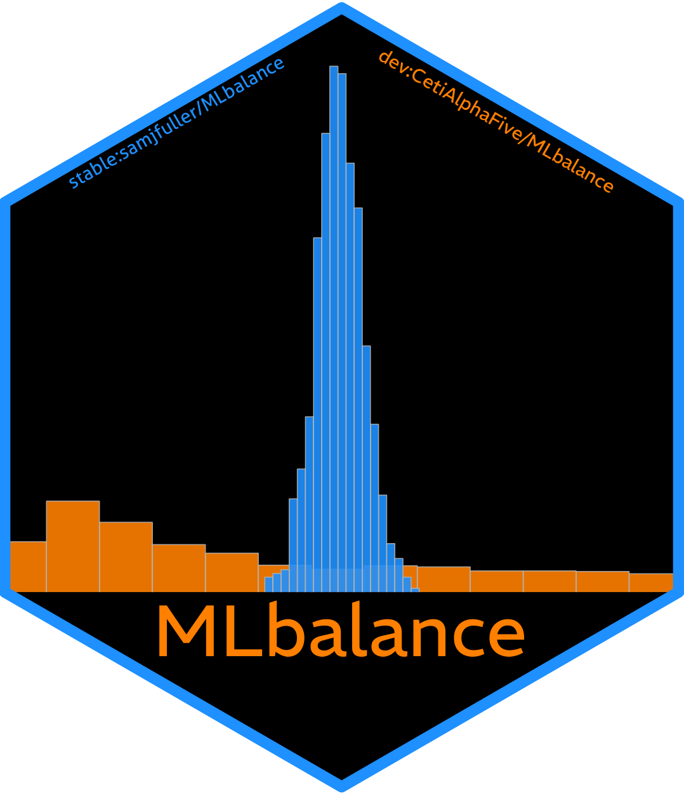

```{r, include = FALSE}
knitr::opts_chunk$set(
  collapse = TRUE,
  comment = "#>",
  fig.path = "man/figures/README-",
  out.width = "100%"
)
```

# MLbalance (beta version) <a href='https://github.com/MLCause/MLbalance/blob/master/man/figures/mlbalance_sticker.png'></a>

MLbalance is a suite of machine learning balance tests and estimation tools for experimental and observational data, including a fast implementation of the classification permutation test (Johann Gagnon-Bartsch and Yotam Shem-Tov, 2019). The purpose of this suite is to detect unintentional failures of random assignment, data fabrication, or simple covariate imbalance in random or, as-if random, experimental designs. These tools are meant to work "off-the-shelf" but are also customizable for advanced users.

This package is in beta, any recommendations or comments welcome in the issues section.  

## Installation

You can install the development version of MLbalance from [GitHub](https://github.com/CetiAlphaFive/MLbalance) with:

``` r
# install.packages("pak")
pak::pak("CetiAlphaFive/MLbalance")
```

## Example 

Here is a basic example demonstrating the suite of machine learning balance tests on a simulated binary treatment DGP with multidimensional contamination of the treatment assignment.

```{r example}
library(MLbalance)
set.seed(1995)
#
# Simple simulation 
n <- 1000
p <- 20
X <- matrix(rnorm(n*p,0,1),n,p)
W <- rbinom(n, 1, ifelse(.021 + abs(.4*X[,4] - .5*X[,8]) < 1, .021 + abs(.4*X[,4] - .5*X[,8]), 1))
Y <- 2*W*X[,4] + 3*X[,2] -2*X[,8] + rnorm(n)
#

b.check <- balance(W = W, #real treatment assignment vector 
                   Y = Y, #outcome variable 
                   X = X, #matrix of pretreatment covariates (or any covariates that SHOULD NOT be related to the assignment process/mechanism)
                   class.method = "ferns" #which classifier? 
             )
```

One can quickly evaluate the output of the tests using the built in plot and summary functions. 

To plot, simply execute: 
```{r}
b.check |> plot()
```

To summarize, simply execute: 
```{r}
b.check |> summary()
```


