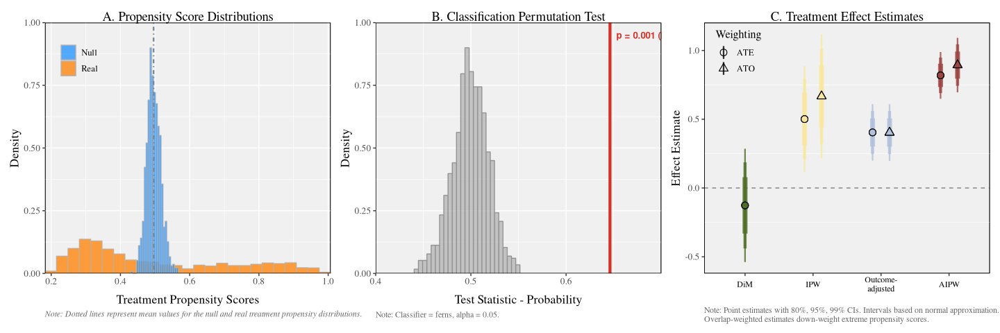

# Machine Learning Balance <a href='https://github.com/CetiAlphaFive/MLbalance/blob/master/man/figures/mlbalance_sticker.png'></a>

[](https://github.com/CetiAlphaFive/MLbalance/actions/workflows/check-standard.yaml)
[](https://codecov.io/gh/CetiAlphaFive/MLbalance)
[](https://github.com/CetiAlphaFive/MLbalance/actions/workflows/lint.yaml)

MLbalance is a suite of machine learning balance tests and estimation
tools for experimental and observational data, including a fast
implementation of the classification permutation test (Johann
Gagnon-Bartsch and Yotam Shem-Tov, 2019). The purpose of this suite is
to detect unintentional failures of random assignment, data fabrication,
or simple covariate imbalance in random or, as-if random, experimental
and observational designs. These tools are meant to work “off-the-shelf”
but are also customizable for advanced users.

This package is in beta, any recommendations or comments welcome in the
issues section.

## Installation

You can install the development version of MLbalance from
[GitHub](https://github.com/CetiAlphaFive/MLbalance) with:

``` r
# install.packages("pak")
pak::pak("CetiAlphaFive/MLbalance")
```

## Example

Here is a basic example demonstrating the suite of machine learning
balance tests on a simulated binary treatment DGP with multidimensional
contamination of the treatment assignment.

``` r
library(MLbalance)
set.seed(1995)

# binary toy example 
n  <- 1000
p  <- 10
X  <- matrix(rnorm(n*p,0,1),n,p)
W  <- rbinom(n, 1, ifelse(.021 + abs(.4*X[,4] - .5*X[,8]) < 1, .021 + abs(.4*X[,4] - .5*X[,8]), 1)) #imbalance over X4 and X8
Y  <- W + 0.8 * X[,1] - 0.6 * X[,2] + 1.2 * X[,3]^2 + 1.5 * X[,4] * X[,8] + 0.5 * X[,6] * X[,7] - 0.4 * abs(X[,9]) + 0.3 * X[,10] * X[,1] + rnorm(n, 0, .5) #true treatment effect = 1, annoying DGP                       

df <- data.frame(Y = Y,W = W,X = X)

# execute the balance tests and estimate treatment effects
b  <- balance(Y,W,X); b
#> 
#> Balance Assessment
#> ------------------------------------------------------------
#>   Control:  '0'
#>   Balance:  p = 0.0010  [FAIL]
#> 
#> Treatment Effect Estimates
#> ------------------------------------------------------------
#>   DiM:                          -0.1265  (SE:  0.1599)
#>   IPW:                           0.5008  (SE:  0.1496)
#>   Outcome-adjusted:              0.3941  (SE:  0.0796)
#>   AIPW:                          0.8070  (SE:  0.0661)
#> 
#>   OVERLAP WARNING: 16 observations have extreme propensity scores.
#> 
#> Use summary() for full details, plot() to visualize.
```

One can quickly evaluate the output of the tests using the built in plot
and summary functions.

To plot, simply execute:

``` r
b |> plot()
```



To summarize, simply execute:

``` r
b |> summary()
#> 
#> ========================================================================
#>                    COVARIATE BALANCE ASSESSMENT                        
#> ========================================================================
#> 
#> 1. SAMPLE
#> ------------------------------------------------------------------------
#>    Observations:    1000
#>    Control ('0'):  504 (50.4%)
#>    Treatment:       496 (49.6%)
#> 
#> 2. CLASSIFICATION PERMUTATION TEST
#> ------------------------------------------------------------------------
#>    Classifier:          ferns
#>    Permutations:        1000
#>    Test statistic:      0.6461
#>    Null mean (SD):      0.4994 (0.0190)
#>    P-value:             0.0010
#>    Alpha:               0.05
#>    Result:              FAIL
#> 
#>    Propensity scores (boosted regression forest):
#>                            Real        Null
#>    ----------------------------------------
#>    Mean:                 0.4947      0.4966
#>    SD:                   0.2207      0.0204
#>    Min:                  0.1824      0.4302
#>    Max:                  1.0077      0.5671
#>    ----------------------------------------
#>    Diff. in means:      -0.0018
#>    Ratio of SDs:        10.8183
#> 
#> 3. INTERPRETATION
#> ------------------------------------------------------------------------
#>    The classification permutation test rejects the null hypothesis,
#>    indicating that treatment and control groups differ in their
#>    covariate distributions. The classifier can distinguish between
#>    groups better than random chance.
#> 
#> ========================================================================
#>                    TREATMENT EFFECT ESTIMATION                         
#> ========================================================================
#> 
#> 4. ESTIMATES
#> ------------------------------------------------------------------------
#>    Estimator                    Estimate        SE                95% CI
#>    ---------------------------------------------------------------------
#>    DiM                           -0.1265    0.1599  [ -0.4400,   0.1869]
#>    IPW                            0.5008    0.1496  [  0.2077,   0.7940]
#>    Outcome-adjusted               0.3941    0.0796  [  0.2380,   0.5501]
#>    AIPW                           0.8070    0.0661  [  0.6775,   0.9366]
#> 
#>    OVERLAP WARNING: 16 observations have extreme propensity scores
#>    (< 0.05 or > 0.95). Overlap-weighted estimates down-weight these:
#> 
#>    Estimator                    Estimate        SE                95% CI
#>    ---------------------------------------------------------------------
#>    IPW (OW)                       0.6671    0.1757  [  0.3227,   1.0116]
#>    Outcome-adj. (OW)              0.3931    0.0797  [  0.2368,   0.5493]
#>    AIPW (OW)                      0.8825    0.0771  [  0.7313,   1.0337]
#> 
#> 
#> 5. ESTIMATOR DIVERGENCE TESTS
#> ------------------------------------------------------------------------
#>    Comparison                    Difference   SE(diff)   z-stat   p-value
#>    ----------------------------------------------------------------------
#>    DiM vs IPW                       -0.6274     0.0691   -9.084    0.0000 *
#>    DiM vs Outcome-adj.              -0.5206     0.1241   -4.195    0.0000 *
#>    DiM vs AIPW                      -0.9336     0.1314   -7.106    0.0000 *
#>    IPW vs AIPW                      -0.3062     0.1197   -2.557    0.0106 *
#>    * p < 0.05
#> 
#>    Significant divergences:
#> 
#>    DiM vs IPW: The IPW estimate differs from the unadjusted DiM
#>    by 0.6274 units (z = -9.084, p = 0.0000), indicating that propensity
#>    reweighting accounts for this difference.
#> 
#>    DiM vs Outcome-adjusted: The outcome-adjusted estimate differs from
#>    the unadjusted DiM by 0.5206 units (z = -4.195, p = 0.0000), indicating
#>    that outcome regression adjustment accounts for this difference.
#> 
#>    DiM vs AIPW: The AIPW estimate differs from the unadjusted DiM
#>    by 0.9336 units (z = -7.106, p = 0.0000), reflecting the combined
#>    effect of propensity and outcome adjustment.
#> 
#>    IPW vs AIPW: Adding outcome regression to propensity reweighting
#>    changes the estimate by 0.3062 units (z = -2.557, p = 0.0106),
#>    indicating that outcome modeling captures additional
#>    covariate-outcome associations beyond reweighting.
#> 
#> 6. ESTIMATOR GUIDE
#> ------------------------------------------------------------------------
#>    All adjusted estimators use grf::causal_forest's AIPW framework.
#>    They differ in which nuisance models (propensity and/or outcome)
#>    are estimated vs. held at uninformative constants.
#> 
#>    We present four ATE estimates as a robustness decomposition.
#>    Agreement across estimators signals robustness to modeling choices.
#>    Divergence reveals which adjustment component (propensity vs.
#>    outcome) most affects the estimate and warrants investigation.
#> 
#>    Nuisance models are fit using honest, tuned boosted regression
#>    forests (grf::boosted_regression_forest; honesty = TRUE,
#>    tune.parameters = "all"); all predictions are out-of-bag.
#>    Treatment effects are estimated via grf::causal_forest
#>    and grf::average_treatment_effect (target = "all").
#>    Standard errors use the infinitesimal jackknife (IJ) influence
#>    function. DiM SEs use Neyman's separate-variance (Welch) formula.
#>    All confidence intervals use a normal approximation.
#> 
#>    DiM (difference-in-means)
#>      E[Y|W=1] - E[Y|W=0]. No covariate adjustment.
#> 
#>    IPW (inverse propensity weighted)
#>      W.hat = boosted-RF propensity; Y.hat = mean(Y) (constant).
#>      Isolates the effect of propensity score reweighting.
#> 
#>    Outcome-adjusted (regression adjustment)
#>      W.hat = mean(W) (constant); Y.hat = boosted-RF outcome predictions.
#>      Isolates the effect of outcome regression adjustment.
#> 
#>    AIPW (augmented IPW / doubly robust)
#>      Both nuisance models estimated. Consistent if either is correct.
#> 
#>    Overlap-Weighted (OW) Estimates
#>      When propensity scores approach 0 or 1, AIPW estimators become
#>      unstable. Overlap-weighted estimates (Li, Morgan & Zaslavsky, 2018)
#>      target the ATE for the overlap population by down-weighting units
#>      with extreme propensity scores. Computed via
#>      grf::average_treatment_effect(target.sample = "overlap").
```
